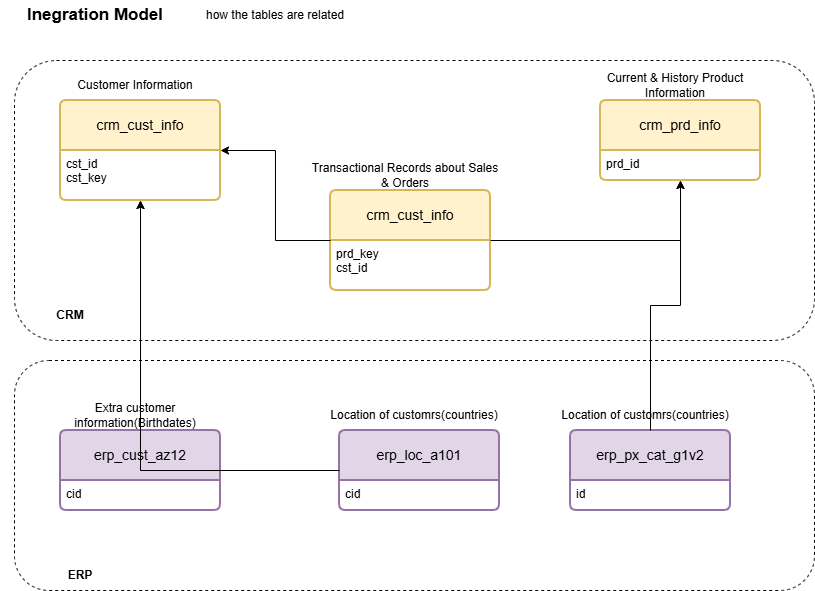

# SQL Data Warehouse Project

A personal project where I build a data warehouse from scratch using the **Medallion Architecture** (Bronze → Silver → Gold), following data engineering best practices. Raw CSV data from two source systems (CRM and ERP) is loaded, cleaned, and modelled into a structured warehouse.

> Project management board: [Notion](https://www.notion.so/SQL-Data-Warehouse-Project-c3364da2589582ce9bff011452889691)

<p align="left">
  
  
  
</p>

---

## Table of Contents

1. [Overview](#overview)
2. [Architecture](#architecture)
3. [Source Systems](#source-systems)
4. [Integration Model](#integration-model)
5. [Naming Conventions](#naming-conventions)
6. [Repository Structure](#repository-structure)
7. [Getting Started](#getting-started)
8. [Roadmap](#roadmap)

---

## Overview

The goal of this project is to consolidate customer, product, and sales data from two source systems into a single, well-structured data warehouse. Scope is limited to the warehouse build (ingestion, cleaning, modelling) — analysis and reporting on top of it is out of scope.

| Source | System | Data                                   |
|--------|--------|-----------------------------------------|
| CRM    | Files  | Customer info, product info, sales details |
| ERP    | Files  | Customer birthdates/gender, customer location, product category |

---

## Architecture

The warehouse follows the **Bronze / Silver / Gold** medallion pattern: raw data is landed as-is, cleaned and standardised, then modelled into a structured layer.


| Layer  | Purpose                  | Load Type                           | Transformations                                                            |
|--------|----------------------------|----------------------------------------|-------------------------------------------------------------------------------|
| Bronze | Raw data, as received       | Batch, full load, truncate & insert   | None                                                                            |
| Silver | Cleaned, standardised data | Batch, full load, truncate & insert   | Data cleansing, standardisation, normalisation, enrichment, derived columns   |
| Gold   | Structured, modelled data  | No load (views)                        | Data integration, business logic                                              |

---

## Source Systems

**CRM**
- `crm_cust_info` — customer information
- `crm_prd_info` — current and historical product information
- `crm_sales_details` — transactional sales and order records

**ERP**
- `erp_cust_az12` — extra customer information (birthdates, gender)
- `erp_loc_a101` — customer location (country)
- `erp_px_cat_g1v2` — product category, sub-category, and maintenance info

---

## Integration Model

How the source tables relate to each other across CRM and ERP:



---

## Naming Conventions

Full conventions are documented in [`DWH/naming_conventions.md`](DWH/naming_conventions.md). Summary:

- Use `snake_case`, English names, no SQL reserved words.
- **Bronze / Silver:** `<sourcesystem>_<entity>` (e.g. `crm_cust_info`).
- **Gold:** `<category>_<entity>` (e.g. `dim_customers`, `fact_sales`).
- **Surrogate keys:** `<table_name>_key` (e.g. `customer_key`).
- **Technical columns:** `dwh_<column_name>` (e.g. `dwh_load_date`).
- **Stored procedures:** `load_<layer>` (e.g. `load_bronze`, `load_silver`).

---

## Repository Structure

```
DWH_Personal_Project/
│
└── DWH/                        # Data warehouse project
    │
    ├── datasets/                  # Raw source CSV files
    │   ├── source_crm/
    │   └── source_erp/
    │
    ├── documents/                 # Architecture & design diagrams
    │   ├── DWH Architecture.png / .drawio
    │   └── intergration_model.png / .drawio
    │
    ├── scripts/                    # SQL scripts
    │   ├── database_init.sql       # Creates DataWarehouse DB + BRONZE/SILVER/GOLD schemas
    │   ├── BRONZE/
    │   │   ├── ddl_bronze.sql
    │   │   └── proc_load_bronze.sql
    │   └── SILVER/
    │       ├── ddl_silver.sql
    │       └── proc_load_silver.sql
    │
    └── naming_conventions.md
```

---

## Getting Started

1. Run [`DWH/scripts/database_init.sql`](DWH/scripts/database_init.sql) to create the `DataWarehouse` database and the `BRONZE`, `SILVER`, and `GOLD` schemas.

   > ⚠️ This script drops the `DataWarehouse` database if it already exists. Back up first.

2. Run [`DWH/scripts/BRONZE/ddl_bronze.sql`](DWH/scripts/BRONZE/ddl_bronze.sql) to create the Bronze tables, then execute the `proc_load_bronze` procedure to load the raw CSVs from `DWH/datasets/`.
3. Run [`DWH/scripts/SILVER/ddl_silver.sql`](DWH/scripts/SILVER/ddl_silver.sql) to create the Silver tables, then execute the `proc_load_silver` procedure to clean and standardise the Bronze data.
4. Gold layer scripts are coming next — see [Roadmap](#roadmap).

---

## Roadmap

- [x] Bronze layer: raw ingestion
- [x] Silver layer: cleansing & standardisation
- [ ] Gold layer: modelled views
- [ ] Data quality checks

---

*Tracked on [Notion](https://www.notion.so/SQL-Data-Warehouse-Project-c3364da2589582ce9bff011452889691).*
